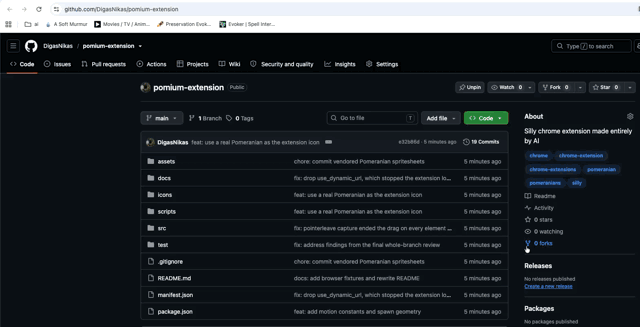

# Pomium

A Chrome extension that reproduces [screen.toys/poms](https://screen.toys/poms/)
on any web page. Click anywhere and a pair of Pomeranians sweeps across the
viewport behind a fire shockwave, with a short camera shake. Hold and drag for
a continuous stream.

## Install (unpacked)

1. Open `chrome://extensions`
2. Enable "Developer mode" (top right).
2. "Load unpacked", select this folder.
3. Click any page.

## Layout

| Path | Responsibility |
| --- | --- |
| `src/content.js` | Classic content script; dynamic-imports the module graph |
| `src/main.js` | Listeners, lazy start, idle teardown |
| `src/overlay.js` | Shadow-rooted, pointer-transparent fixed canvas |
| `src/engine.js` | Spawning, camera shake, drag streaming |
| `src/geometry.js` | Spawn line, heading, depth scaling |
| `src/sprites.js` | Sprite lifecycle, culling, active cap |
| `src/atlas.js` | Atlas parsing, LRU bitmap cache |
| `src/atlas-loader.js` | CSP-safe fetch to `ImageBitmap` |
| `src/loop.js` | Fixed 30 updates/second accumulator |
| `src/render.js` | Canvas2D drawing |
| `src/config.js` | Every tuning constant |
| `scripts/fetch-assets.sh` | Vendors the spritesheets from screen.toys into `assets/` |
| `icons/` | Toolbar icons, cropped from the bundled artwork |
| `assets/manifest.json` | Character keys and tiers; the art-swap seam |

## Tests

`npm test` runs `node --test "test/**/*.test.js"` — `node:test`, no
dependencies, 67 tests across ten files: `geometry`, `sprites`, `engine`,
`atlas`, `assets-manifest`, `loop`, `render`, `overlay`, `manifest`, and
`config` (the last one guards the `ATLAS_CACHE_LIMIT` / `ROSTER_SIZE`
relationship; `manifest` checks `manifest.json` itself — every path it
references actually exists on disk).

These tests cover the motion maths, sprite lifecycle, engine behaviour,
atlas parsing, cache eviction, the loop's refresh-rate independence, and the
renderer's draw arguments. **They do not cover DOM assembly, network asset
loading, or anything about how it looks or feels in a real browser.** That
part has to be checked by a human — see
[`docs/manual-verification.md`](docs/manual-verification.md) for the exact
steps and the four fixture pages under `test/fixtures/` (`page-dark.html`,
`page-light.html`, `page-csp.html`, `page-scroll.html`) they use.

## Artwork

The spritesheets are by [shapiro500](https://www.instagram.com/shapiro500/)
and carry no posted licence. They are committed to this repository so it
clones and loads without a fetch step; `scripts/fetch-assets.sh` remains
their provenance record and re-fetches them from screen.toys.

## Known limitations

- No overlay inside a fullscreen element: fixed positioning cannot escape the
  fullscreen top layer.
- Cannot run on `chrome://` pages or the Chrome Web Store.
- Dormant under `prefers-reduced-motion: reduce`.
